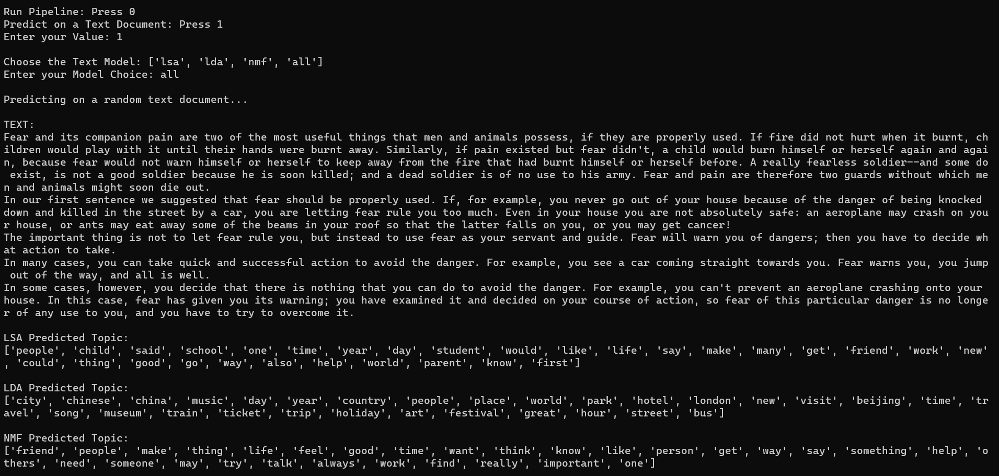

# Topic-Modelling-Using-RACE-Dataset


## Business Context
Think when you have to analyze or go through thousands of documents and categorize under 10 – 15 buckets. How tedious and boring will it be ?
Thanks to Topic Modeling where instead of manually going through numerous documents, with the help of Natural Language Processing and Text Mining, each document can be categorized under a certain topic.

- We expect that logically related words will co-exist in the same document more frequently than words from different topics. 
    - For example, in a document about space, it is more possible to find words such as: planet, satellite, universe, galaxy, and asteroid. Whereas, in a document about the wildlife, it is more likely to find words such as: ecosystem, species, animal, and plant, landscape. 
    
- A topic contains a cluster of words that frequently occurs together. 
- A topic modeling algorithm can connect words with similar meanings and distinguish between uses of words with multiple meanings. 
- A sentence or a document is made up of numerous topics and each topic is made up of numerous words.


## Tech Stack
- $\rightarrow$ **Language:** Python
- $\rightarrow$ **Libraries:** `nltk`, `gensim`, `BERTopic`, `Top2Vec`, `tqdm`, `numpy`, `joblib`, `pandas`, `scikit_learn`, `bokeh`, `t-SNE`, `pyLDAvis`
<!-- ➔ Services: Flask, Docker, AWS, Gunicorn -->


## Output
<div align='center'>
    
    
    
    
    
    
</div>


## Dataset Summary
The **ReAding Comprehension dataset from Examinations (RACE)** dataset is a machine reading comprehension dataset consisting of 27,933 passages and 97,867 questions from English exams, targeting Chinese students aged 12-18. RACE consists of two subsets, RACE-M and RACE-H, from middle school and high school exams, respectively. RACE-M has 28,293 questions and RACE-H has 69,574. Each question is associated with 4 candidate answers, one of which is correct. The data generation process of RACE differs from most machine reading comprehension datasets - instead of generating questions and answers by heuristics or crowd-sourcing, questions in RACE are specifically designed for testing human reading skills, and are created by domain experts.

>**From the following data we extract `article` field from each text file and collectively keep under one csv file for our topic modeling experiments. Complete data is split 90% in the training and the rest 10% to get an idea how to predict a topic on unseen documents.**


## Objective
**To extract or identify a dominant topic from each document and perform topic modeling.**


## Tools and Libraries
We will be using Python as a tool to perform all kinds of operations.
Main Libraries used are:
- `urllib`, `tarfile`, `json`, `csv` to get, extract and parse the text data
- `pandas` for data manipulation, aggregation
- `matplotlib` and `bokeh` for visualization of how documents are structured.
- `numpy` for computationally efficient operations.
- `scikit-learn` and `gensim` packages for topic modeling
- `nltk` for text cleaning and preprocessing
- `TSNE` and `pyLDAvis` for visualization of topics


## Approach
- Topic EDA
    - Top Words within topics using `WordCloud`
    - Topics distribution using `t-SNE`
    - Topics distribution and words importance within topics using interactive tool `pyLDAvis`

- Documents Pre-processing
    - Lowering all the words in documents and removing everything except alphabets.
    - Tokenizing each sentence and lemmatizing each word and storing in a list only if it is not a stop word and length of a word is greater than 3 alphabets.
    - Joining the list to make a document and also keeping the lemmatized tokens for NMF Topic Modelling.
    - Transforming the above pre-processed documents using TF-IDF and Count Vectorizer depending on the chosen algorithm

- Topic Modelling algorithms
    - Latent Semantic Analysis(LSA) or Latent Semantic Indexing(LSI)
    - Latent Dirichlet Allocation (LDA)
    - Non-Negative Matrix Factorization (NMF)
    - Popular topic modelling metric score known as Coherence Score, Perplexity
    - Predicting a set of topics and the dominant topic for each documents


## Code Overview

0. All text files is parsed and coverted to a `csv` file for further usage.

1. Complete dataset is splitted into 90% for training and 10% for predicting unseen documents.

2. Preprocessing is done to avoid noise
    - Lowering all the words and replacing words in their normal form and keeping only alphabets.
    - Making a new document after tokenizing each sentence and lemmatizing every word.

4. For LSA and LDA Topic Modeling
    - `TF-IDF` Vectorizer and `Count` Vectorizer is fitted and transformed on a clean set of documents and topics are extracted using sklean LSA and LDA packages respectively and proceeded with 10 topics for both the algorithms.

5. For NMF Topic Modeling
    - `TF-IDF` Vectorizer is fitted and transformed on clean tokens and 22 topics are extracted and the number was found using Coherence Score.

6. Topics distribution is analyzed using `t-SNE` algorithm and iterative tool using `pyLDAvis`.

7. For unseen documents, topics were predicted using the above three algorithms.


## Folder Structure
```
config
    |__config.yaml
    |__check.yaml
input
    |__ingested_data
        |__cleaned_test_documents.csv
        |__cleaned_train_documents.csv
        |__documents.csv
    |__raw_data
        |__RACE
    |__tgz_data
        |__RACE.tar.gz
notebooks
    |__images
    |__DBA_Latent_Semantic_Analysis.ipynb
    |__Theory_Latent_Dirichlet_Allocation.ipynb
    |__Theory_Latent_Semantic_Analysis.ipynb
    |__Theory_NMF.ipynb
    |__Topic Modelling.ipynb (**MAIN NOTEBOOK**)
output
    |__model_output
        |__lda_outputs
        |__lsa_outputs
        |__nmf_outputs
    |__saved_models
    |__saved_vectorizers
pipeline
    |__data_preprocessing.py
    |__get_data.py
    |__predict_on_single_document.py
    |__predict_topics.py
    |__run_pipeline.py
    |__show_topics.py
    |__topic_modeling.py
    |__utils.py
    |__vectorize_data.py
```


## Project Takeaways
- Understanding the problem statement
- How and what kind of text cleaning needs to be done
- What tokenization and lemmatization is
- Performing EDA on documents word and POS counts, most occurring words
- Types of vectorizer such as TF IDF and Countvectorizer
- Understanding the in-depth workings behind various Topic Modeling algorithms like LSA, LDA, NMF: [**Check Theory Notebooks**](https://github.com/avr2002/Topic-Modelling-Using-RACE-Dataset/tree/main/notebooks)
- Implementation of Topic Modeling algorithms such as LSA(Latent Semantic Analysis), LDA(Latent Dirichlet Allocation), NMF(Non-Negative Matrix Factorization): [**Check Main Notebook**](https://github.com/avr2002/Topic-Modelling-Using-RACE-Dataset/blob/main/notebooks/Topic%20Modelling.ipynb)
- Hyper parameter tuning using GridSearchCV
- Analyzing top words for topics and top topics for documents
- Distribution of topics over the entire corpus
- Visualizing distribution of topics using TSNE
- Visualizing top words in a topic using WordCloud
- Visualizing the distribution of topics and the occurrence and weightage of words using interactive tool which is pyLDAvis
- Comparing and checking the distribution of the topics using metrics such as Perplexity and Coherence Score
- Training and predicting the documents using LDA and NMF in a modular code using python script.


## Replicate 
### 1. Create a new environment

   - `conda create -p topic_venv python==3.10 -y`
   - `conda activate topic_venv/`

### 2. Install all the requirements

   - `python -m pip install --upgrade pip`
   - `python -m pip install -r requirements.txt`

### 3. Code Execution

   - Run `python engine.py` to train the models and predict on text documents


## More About RACE Dataset

### Data Fields
- Data Structure:
    ```
    Each passage is a JSON file. The JSON file contains following fields:

    article: A string, which is the passage.
    questions: A string list. Each string is a query. We have two types of questions. First one is an interrogative sentence. Another one has a placeholder, which is represented by _.
    options: A list of the options list. Each options list contains 4 strings, which are the candidate option.
    answers: A list contains the golden label of each query.
    id: Each passage has a unique id in this dataset.
    ```

- Example Data
    ```
    This example was too long and was cropped:

    {
        "answer": "A",
        "article": "\"Schoolgirls have been wearing such short skirts at Paget High School in Branston that they've been ordered to wear trousers ins...",
        "example_id": "high132.txt",
        "options": ["short skirts give people the impression of sexualisation", "short skirts are too expensive for parents to afford", "the headmaster doesn't like girls wearing short skirts", "the girls wearing short skirts will be at the risk of being laughed at"],
        "question": "The girls at Paget High School are not allowed to wear skirts in that    _  ."
    }
    ```

### Data Sources
- [Dataset Link](https://www.cs.cmu.edu/~glai1/data/race/)
- [arxiv.org](https://arxiv.org/abs/1704.04683)
- [paperswithcode.com](https://paperswithcode.com/dataset/race#:~:text=The%20ReAding%20Comprehension%20dataset%20from,Chinese%20students%20aged%2012%2D18.)
